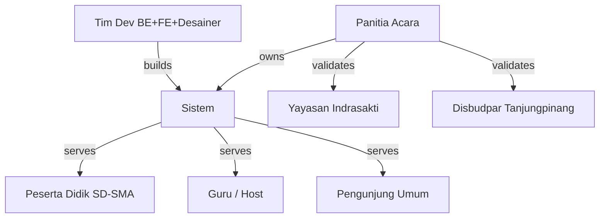

# 01 — Requirements & Scope
## Jejak Inderasakti: Jelajah Pulau Penyengat

> **Dokumen**: PRD / BRD · User Persona · Use Case · User Story · Functional & Non-Functional Spec · MVP Definition · Stakeholder Analysis  
> **Versi**: 1.0 · **Tanggal**: 2026-09-19 · **Status**: Draft

---

## 1. Problem Statement & Goals

### 1.1 Masalah yang Diselesaikan

Pulau Penyengat adalah kawasan warisan budaya Melayu yang kaya — rumah bagi 5 situs cagar budaya: Masjid Raya Sultan Riau, Makam Engku Putri & Raja Abdurrahman, Istana Kantor, Gedung Tabib, dan Perigi Puteri. Namun:

| Masalah | Dampak |
|---|---|
| Pengetahuan sejarah lokal tidak tersampaikan secara menarik kepada pelajar | Rendahnya apresiasi terhadap warisan budaya Melayu |
| Kunjungan lapangan ke Pulau Penyengat tidak selalu disertai media edukatif interaktif | Informasi hanya diterima pasif, cepat terlupakan |
| Tidak ada media kuis yang memanfaatkan teknologi real-time untuk konteks budaya Riau | Guru/panitia tidak punya alat yang relevan dan menarik |
| Generasi muda lebih familiar dengan game digital daripada metode pembelajaran konvensional | Gap antara cara belajar efektif dan metode yang tersedia |

### 1.2 Solusi

**Jejak Inderasakti** adalah game kuis web mobile-first, multiplayer real-time, yang membawa peserta "menjelajahi" 5 situs cagar budaya Pulau Penyengat melalui pertanyaan berbasis riset yang dikemas dalam antarmuka bergaya peta petualangan Melayu.

### 1.3 Goals

| Tujuan | Metrik Sukses |
|---|---|
| **Edukatif**: Setelah 1 sesi, peserta mampu menyebutkan 5 situs + tokoh kunci | ≥ 70% menjawab benar soal "mudah" tentang setiap situs |
| **Keterlibatan**: Peserta aktif dari awal hingga akhir sesi | Drop-off rate < 10% di tengah sesi |
| **Teknis**: Sistem berjalan stabil untuk acara Kamis 24/9 | 0 error pada uji beban 75 pemain; p95 ack < 300 ms |
| **Adopsi**: Guru/panitia dapat menggunakan tanpa pelatihan teknis | Host berhasil membuat dan menjalankan room pertama < 5 menit |

---

## 2. Scope & MVP Definition

### 2.1 In-Scope (Versi Kamis, 24/9/2026)

| Kategori | Fitur |
|---|---|
| **Autentikasi** | Login host via email+password (di-seed panitia); token peserta per-room tanpa akun |
| **Manajemen Room** | Buat room (PIN 6 digit + QR), maks. 15 peserta/room, maks. 5 room bersamaan |
| **Gameplay** | 15 soal per sesi (5 situs × 3 soal), Sesi Singkat 10 soal; timer per soal; poin + bonus beruntun |
| **Multiplayer** | WebSocket real-time; tempo per peserta (bukan serentak); leaderboard real-time di layar host |
| **Bilingual** | Bahasa Indonesia & Inggris, dipilih per pemain, bisa campur dalam satu room |
| **Gamifikasi** | Maskot Sakti, leaderboard, podium 3 besar, Kartu Warisan, rekap sekolah |
| **Host Dashboard** | Buat room, pantau progres, lihat leaderboard, akhiri sesi, unduh CSV |
| **Bank Soal** | 60 soal situs + 6 cadangan, di-seed dari JSON; bilingual ID/EN |
| **Reconnect** | Pemain terputus dapat masuk kembali dengan PIN yang sama |
| **Ekspor** | CSV hasil per room |

### 2.2 Out-of-Scope (Setelah Launch)

| Fitur | Alasan Ditunda |
|---|---|
| Mode Mandiri (gaya Duolingo) | Butuh akun pemain permanen |
| Jelajah Lapangan (geolocation) | Infrastruktur tambahan dan UX kompleks |
| Lencana situs & prestasi jangka panjang | Butuh akun dan sistem persist |
| XP, gelar, streak harian | Butuh akun pemain |
| Sertifikat PDF | Post-launch |
| Bantuan 50:50 & Bisikan Sakti | Post-launch |
| CMS soal berbasis web | Versi Kamis pakai seed JSON |
| Analitik butir soal (psikometri) | Post-launch |
| Manajemen akun host mandiri | Versi Kamis di-seed panitia |
| Grafik & filter rekap sekolah | Versi sederhana dulu |
| Kubernetes, CDN, message queue | Overkill untuk 75 pemain |
| Mode offline / PWA | Online-only per desain |

### 2.3 Sesi Singkat vs Normal

| Parameter | Sesi Normal | Sesi Singkat |
|---|---|---|
| Soal per sesi | 15 (3/situs) | 10 (2/situs) |
| Durasi estimasi | 5–10 menit | ±4 menit |
| Pemilihan soal | Penuh per komposisi level | Soal pertama + terakhir per sel |
| Kapan dipakai | Standar | Waktu sangat terbatas |

---

## 3. Stakeholder Analysis

### 3.1 Peta Stakeholder



### 3.2 Stakeholder & Priority Table

| Stakeholder | Peran | Kebutuhan Utama | Prioritas |
|---|---|---|---|
| **Panitia acara** | Owner, admin | Kontrol penuh, data ekspor, akun host | Must Have |
| **Guru / Host** | Operator | Buat room mudah, pantau real-time, download hasil | Must Have |
| **Peserta SD (9–12 th)** | End User | Bahasa sederhana, visual besar, timer lebih lambat | Must Have |
| **Peserta SMP (12–15 th)** | End User | Tantangan & kompetisi | Must Have |
| **Peserta SMA/SMK (15–18 th)** | End User | Soal analitis, adu antarsekolah | Must Have |
| **Pengunjung umum** | End User | Versi Inggris, tanpa perlu tahu konteks sekolah | Should Have |
| **Yayasan Indrasakti** | Validator konten | Akurasi historis bank soal | Should Have |
| **Disbudpar Tanjungpinang** | Validator lapangan | Kepatuhan data situs cagar budaya | Nice to Have |
| **Tim Dev (BE+FE+Desainer)** | Builder | Kontrak API jelas, dokumen lengkap, scope terbatas | Must Have |

### 3.3 MoSCoW Priority

| Priority | Fitur |
|---|---|
| **Must Have** | Room+PIN, WebSocket gameplay, scoring, leaderboard, bilingual, host dashboard, seed soal |
| **Should Have** | Rekap sekolah, ekspor CSV, Kartu Warisan, podium confetti, reconnect |
| **Could Have** | Mode Akurasi, Sesi Singkat, animasi Lottie maskot |
| **Won't Have (v1)** | Akun pemain, CMS, mode offline, badges jangka panjang |

---

## 4. User Persona

### Persona 1 — Bimo, Siswa SD Kelas 5

| Atribut | Detail |
|---|---|
| **Usia** | 10 tahun |
| **Lokasi** | Tanjungpinang, Kepri |
| **Device** | HP Android murah milik orang tua, layar 5.5" |
| **Koneksi** | 4G, kadang sinyal lemah |
| **Motivasi** | Ingin menang di leaderboard, suka gambar warna-warni |
| **Frustrasi** | Bingung dengan istilah sejarah, panik kalau timer hampir habis |
| **Kebutuhan** | Teks besar, timer lebih panjang, feedback langsung, bahasa sederhana |
| **Quote** | "Aku suka kalau Sakti bersorak waktu aku benar!" |

### Persona 2 — Rina, Guru Sejarah SMP

| Atribut | Detail |
|---|---|
| **Usia** | 34 tahun |
| **Peran** | Host / operator room |
| **Device** | Laptop di depan kelas + proyektor |
| **Motivasi** | Membuat pelajaran sejarah lebih menarik, melihat progres siswa |
| **Frustrasi** | Alat yang butuh instalasi rumit, siswa tidak fokus, data tidak tersimpan |
| **Kebutuhan** | Buat room cepat, lihat siapa yang sudah selesai, download rekap nilai |
| **Quote** | "Saya butuh sesuatu yang langsung jalan tanpa IT support." |

### Persona 3 — Arya, Siswa SMA Kelas 11

| Atribut | Detail |
|---|---|
| **Usia** | 16 tahun |
| **Device** | iPhone SE, koneksi WiFi sekolah |
| **Motivasi** | Adu skor dengan teman, membuktikan diri paling tahu sejarah |
| **Frustrasi** | Game yang terlalu mudah atau terlalu lambat |
| **Kebutuhan** | Soal analitis, leaderboard live, podium yang terasa "epic" |
| **Quote** | "Kalau bisa ngalahin teman sekolah lain, barulah seru!" |

### Persona 4 — Sarah, Turis Asing

| Atribut | Detail |
|---|---|
| **Usia** | 28 tahun, warga negara Inggris |
| **Device** | iPhone, koneksi roaming 4G |
| **Motivasi** | Belajar tentang Pulau Penyengat saat berkunjung |
| **Frustrasi** | Konten hanya dalam Bahasa Indonesia |
| **Kebutuhan** | Antarmuka penuh Bahasa Inggris, tanpa perlu daftar akun |
| **Quote** | "I want to learn about this island without needing to read Indonesian." |

---

## 5. Use Case Diagram & Deskripsi

### 5.1 Use Case Diagram

```
+-------------------------------------------------------------+
|                    Sistem Jejak Inderasakti                 |
|                                                             |
|   +-------+   +-------------------------------------+      |
|   | Host  |-->| UC-H1: Login                        |      |
|   +---+---+   +-------------------------------------+      |
|       |        | UC-H2: Buat Room                   |      |
|       |        +-------------------------------------+      |
|       |        | UC-H3: Pantau Lobby & Mulai Sesi   |      |
|       |        +-------------------------------------+      |
|       |        | UC-H4: Monitor Progres & Leaderboard|     |
|       |        +-------------------------------------+      |
|       |        | UC-H5: Akhiri Sesi & Ekspor CSV    |      |
|       |        +-------------------------------------+      |
|                                                             |
|   +---------+ +-------------------------------------+      |
|   | Peserta |->| UC-P1: Masuk Room via PIN/QR       |      |
|   +----+----+ +-------------------------------------+      |
|        |       | UC-P2: Daftar (nama, sekolah, avatar)|    |
|        |       +-------------------------------------+      |
|        |       | UC-P3: Menjawab Soal               |      |
|        |       +-------------------------------------+      |
|        |       | UC-P4: Melihat Umpan Balik & Poin  |      |
|        |       +-------------------------------------+      |
|        |       | UC-P5: Reconnect Setelah Putus     |      |
|        |       +-------------------------------------+      |
|        |       | UC-P6: Melihat Podium Akhir        |      |
|        |       +-------------------------------------+      |
+-------------------------------------------------------------+
```

### 5.2 Deskripsi Use Case

#### UC-H2: Buat Room

| Atribut | Detail |
|---|---|
| **Actor** | Host (sudah login) |
| **Pre-condition** | Host terautentikasi; jumlah room aktif < 5 |
| **Main Flow** | 1. Host memilih jenjang (SD/SMP/SMA) → 2. Pilih Sesi Normal/Singkat → 3. Aktifkan/nonaktifkan Mode Akurasi → 4. Klik Buat Room → 5. Sistem generate PIN 6 digit unik + QR code → 6. Host melihat lobby dengan PIN besar |
| **Alternate Flow** | Jika sudah ada 5 room aktif → sistem return 409 + pesan "Room penuh, coba sebentar lagi" |
| **Error Case** | JWT kedaluwarsa → redirect login |
| **Post-condition** | Room tersimpan di DB dengan status `lobby`; PIN tersimpan di Redis TTL 2 jam |

#### UC-P3: Menjawab Soal

| Atribut | Detail |
|---|---|
| **Actor** | Peserta (sudah dalam room, room status `running`) |
| **Pre-condition** | Peserta telah mengirim `q.next` dan menerima `q.show` |
| **Main Flow** | 1. Peserta membaca soal (masa baca: 2 detik/SD 3 detik) → 2. Peserta mengetuk opsi jawaban → 3. Server menerima `q.answer` → 4. Server validasi deadline, hitung poin, simpan ke DB, update Redis sorted set → 5. Server kirim `q.result` ke peserta + `lb.update` ke host |
| **Alternate Flow A** | Peserta tidak menjawab dalam batas waktu → server otomatis catat 0 poin saat peserta kirim `q.next` berikutnya |
| **Alternate Flow B** | Peserta mencoba jawab soal yang sudah lewat deadline (+1000ms toleransi) → server tolak, return 0 poin |
| **Error Case** | Koneksi terputus → soal timer terus berjalan; saat reconnect server kirim `room.state` + soal aktif |
| **Post-condition** | `answers` tersimpan; skor `room_players` terupdate; Redis sorted set terupdate |

#### UC-P5: Reconnect

| Atribut | Detail |
|---|---|
| **Actor** | Peserta (terputus di tengah sesi) |
| **Pre-condition** | Room masih `running`; token peserta masih valid |
| **Main Flow** | 1. Peserta reload/buka kembali URL → 2. Layar meminta PIN → 3. Peserta masukkan PIN yang sama → 4. Sistem validasi token → 5. Server kirim `room.state` berisi index soal terakhir → 6. Peserta lanjut |
| **Error Case** | Token tidak valid → peserta harus daftar ulang (jika masih ada slot) |

---

## 6. User Story

### Epic 1: Room Management (Host)

| ID | User Story | Priority | Acceptance Criteria |
|---|---|---|---|
| US-H01 | Sebagai host, saya ingin membuat room dengan memilih jenjang dan tipe sesi | Must Have | Room terbuat dengan PIN 6 digit unik; QR ter-generate; status `lobby` |
| US-H02 | Sebagai host, saya ingin melihat peserta yang bergabung secara real-time | Must Have | Nama + avatar peserta muncul dalam < 1 detik; counter x/15 terupdate |
| US-H03 | Sebagai host, saya ingin menekan tombol Mulai setelah semua peserta siap | Must Have | Semua peserta menerima `room.started`; soal pertama bisa diminta |
| US-H04 | Sebagai host, saya ingin melihat leaderboard real-time saat game berlangsung | Must Have | `lb.update` dikirim maks. 1x/detik; nama + skor + peringkat tampil akurat |
| US-H05 | Sebagai host, saya ingin mengakhiri sesi kapan saja | Should Have | Tombol Akhiri aktif setelah game mulai; semua peserta menerima `room.ended` |
| US-H06 | Sebagai host, saya ingin mengunduh CSV hasil | Should Have | CSV berisi: nama, sekolah, jenjang, skor, benar, total_ms |

### Epic 2: Gameplay (Peserta)

| ID | User Story | Priority | Acceptance Criteria |
|---|---|---|---|
| US-P01 | Sebagai peserta, saya ingin masuk room dengan PIN 6 digit atau scan QR | Must Have | Berhasil join dengan PIN valid; error jelas jika PIN salah/room penuh |
| US-P02 | Sebagai peserta, saya ingin memilih bahasa (ID/EN) di awal | Must Have | Semua teks UI + konten soal berubah ke bahasa yang dipilih |
| US-P03 | Sebagai peserta, saya ingin melihat timer countdown per soal | Must Have | Timer visual sesuai LimitMs dari server; merah + berdenyut saat < 5 detik |
| US-P04 | Sebagai peserta, saya ingin mendapat feedback langsung setelah menjawab | Must Have | Opsi berubah warna dalam < 300 ms; poin + penjelasan tampil 3 detik |
| US-P05 | Sebagai peserta, saya ingin melihat peringkat saya di akhir setiap stage | Should Have | Ringkasan stage menampilkan peringkat sementara + Kartu Warisan |
| US-P06 | Sebagai peserta, saya ingin melihat podium 3 besar di akhir sesi | Should Have | Podium muncul dengan confetti; nama + avatar + skor 3 teratas |
| US-P07 | Sebagai peserta, saya ingin bisa reconnect jika sinyal terputus | Should Have | Masuk kembali dengan PIN yang sama; lanjut dari soal terakhir |

---

## 7. Functional Requirements

### FR-01: Autentikasi Host
- FR-01.1: Host login dengan email + password; server validasi bcrypt; kembalikan JWT
- FR-01.2: JWT digunakan untuk semua endpoint host (Authorization: Bearer); kedaluwarsa 8 jam

### FR-02: Manajemen Room
- FR-02.1: Host buat room dengan parameter: jenjang, tipe sesi, mode akurasi
- FR-02.2: Sistem generate PIN 6 digit unik dan QR code
- FR-02.3: Tolak pembuatan room ke-6 → HTTP 409
- FR-02.4: Room otomatis berakhir 12 menit setelah dimulai
- FR-02.5: PIN di Redis TTL 2 jam; dihapus saat room berakhir
- FR-02.6: Host dapat kick peserta

### FR-03: Pendaftaran Peserta
- FR-03.1: Peserta masuk via PIN, QR, atau direct link
- FR-03.2: Data dikumpulkan: bahasa, nama (2–20 karakter), sekolah, jenjang, avatar
- FR-03.3: Tidak ada email/HP/tgl lahir/foto
- FR-03.4: Nama unik dalam room; filter kata kasar (ID + Melayu)
- FR-03.5: Tolak peserta ke-16 → HTTP 409
- FR-03.6: Server kembalikan token pemain bertanda tangan, berlaku hanya di room tersebut

### FR-04: Gameplay & Soal
- FR-04.1: Server pilih set soal saat room dibuat (acak sesuai komposisi level+jenjang)
- FR-04.2: Semua peserta dalam satu room dapat set soal yang sama; urutan opsi diacak per peserta
- FR-04.3: Peserta minta soal via `q.next`; server catat `served_at`
- FR-04.4: Server kirim soal (`q.show`) tanpa kunci jawaban
- FR-04.5: Server validasi `q.answer` terhadap deadline + 1000ms toleransi
- FR-04.6: Soal tidak dijawab → dicatat 0 poin saat `q.next` berikutnya

### FR-05: Sistem Penilaian
- FR-05.1: Poin dasar: mudah=500, sedang=750, sulit=1000
- FR-05.2: `P = round(B × (0.6 + 0.4 × (1 - max(0, t-g)/(T-g)))) + S`
- FR-05.3: Salah atau lewat deadline = 0 poin
- FR-05.4: Bonus beruntun: +50 per jawaban benar berturut-turut (mulai ke-2), maks. +250
- FR-05.5: Mode Akurasi: faktor kecepatan dimatikan; setiap benar = B
- FR-05.6: Timer SD × 1.25; masa baca SD = 3000ms, non-SD = 2000ms

### FR-06: Leaderboard & Rekap
- FR-06.1: Leaderboard real-time di layar host, diperbarui maks. 1x/detik
- FR-06.2: Tie-breaking: lebih banyak benar → total waktu lebih kecil
- FR-06.3: Leaderboard sekolah: rata-rata 5 skor tertinggi per sekolah, min. 3 pemain
- FR-06.4: Skor antar-jenjang tidak dibandingkan

### FR-07: Reconnect
- FR-07.1: Peserta reconnect dengan PIN yang sama
- FR-07.2: Server kirim `room.state` (index soal, skor, streak)
- FR-07.3: Soal aktif yang belum lewat deadline dikirim kembali

### FR-08: Bilingual
- FR-08.1: Bahasa dipilih per pemain; semua UI + konten soal dalam bahasa tersebut
- FR-08.2: Satu room dapat berisi pemain berbahasa ID dan EN
- FR-08.3: Server hanya kirim bahasa pemain dalam `q.show` dan `q.result`

### FR-09: Ekspor & Admin
- FR-09.1: CSV hasil room: nama, sekolah, jenjang, skor, benar, total_ms
- FR-09.2: Rekap leaderboard sekolah halaman publik sederhana

---

## 8. Non-Functional Requirements (Ringkasan)

| Kategori | Requirement | Target |
|---|---|---|
| **Performance** | ACK jawaban (p95) | < 300 ms |
| **Performance** | Halaman awal (4G) | < 2.5 detik |
| **Scalability** | Concurrent users | 75 (5 room × 15) |
| **Availability** | Saat acara | 99.9% |
| **Security** | Transmisi | HTTPS wajib |
| **Security** | Kunci jawaban | Tidak pernah di client sebelum jawab |
| **Security** | Rate limit join | 10x/menit per IP |
| **Privacy** | Data anak | Minimal; hapus 12 bulan pasca-acara |
| **Compliance** | PDP | UU No. 27/2022; persetujuan via sekolah |
| **Usability** | Onboarding host | < 5 menit |
| **Accessibility** | Kontras | ≥ 4.5:1 WCAG AA |

---

## 9. Acceptance Criteria (Definition of Done)

| Fitur | Acceptance Criteria |
|---|---|
| Buat Room | Room dalam < 2 detik; PIN + QR muncul dan bisa di-scan |
| Join Room | Peserta join dalam < 3 detik; avatar di lobby host; penolakan jelas jika penuh |
| Gameplay | Soal diterima < 500ms setelah `q.next`; poin sesuai tabel About Game |
| Leaderboard | Update di layar host dalam < 1.5 detik setelah jawaban |
| Reconnect | Kembali dalam < 30 detik → lanjut tanpa restart |
| Bilingual | Semua layar dalam bahasa dipilih; tidak ada teks tercampur |
| Ekspor CSV | Download < 5 detik; kolom sesuai spesifikasi |
| Uji beban | k6: 5 room × 15 pemain, 15 soal, p95 < 300ms, 0 error |
| Uji E2E | Playwright: daftar → 15 soal → podium, kedua bahasa, viewport HP |

---

## 10. Constraints & Assumptions

### Technical Constraints
- VPS: 2 vCPU / 4 GB RAM; tanpa auto-scaling
- Domain + A record siap paling lambat Selasa 22/9
- Aset FE total ≤ 5 MB; bank soal di-seed dari JSON

### Timeline
- Sab 19/9: Kontrak API dikunci; scaffold repo
- Sel 22/9: Deploy staging di VPS
- Rab 23/9: Feature freeze 18.00; uji beban k6 lulus
- Kam 24/9: Deploy produksi; uji pengguna nyata

### Open Questions (Perlu Dijawab Sebelum Kamis)

| # | Pertanyaan | Dampak |
|---|---|---|
| OQ-01 | Siapa yang memvalidasi bank soal? | Risiko konten salah saat acara |
| OQ-02 | Siapa yang mereview terjemahan Inggris? | Versi EN mungkin tidak akurat |
| OQ-03 | Berapa akun host yang dibutuhkan, untuk siapa? | Seed host_users tidak lengkap |
