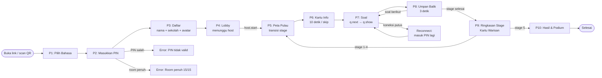
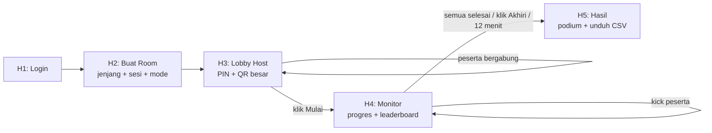

# 02 — UI/UX Design
## Jejak Inderasakti: Jelajah Pulau Penyengat

> **Dokumen**: User Flow · Wireframe · Design System · Component Spec · Usability Testing Plan  
> **Versi**: 1.0 · **Tanggal**: 2026-09-19

---

## 1. Prinsip Desain

| # | Prinsip | Implikasi |
|---|---|---|
| 1 | **Satu layar, satu tugas** | Tidak ada menu tersembunyi; setiap layar punya satu aksi utama |
| 2 | **Besar dan berwarna** | Teks min. 16px; tombol jawaban min. 64px tinggi; warna situs sebagai penanda stage |
| 3 | **Umpan balik instan** | Benar/salah terlihat < 300ms: warna + ikon + suara + ekspresi maskot |
| 4 | **Kolase kertas Melayu** | UI seperti buku perjalanan: memo, selotip, struk, prangko, peta lipat |
| 5 | **Bilingual sejak awal** | Tidak ada teks di dalam gambar; layout diuji dengan teks Indonesia (lebih panjang) |

**Referensi desain:**
- **Quizizz**: room ber-PIN, kotak jawaban besar, leaderboard dan podium
- **Duolingo**: maskot ekspresif, tombol tebal, peta jalur stage
- **KŌSA (Hello-World)**: gaya kolase stiker, kertas bertempel, metafora persimpangan — hanya strukturnya, bukan palet atau aset

---

## 2. User Flow

### 2.1 Flow Peserta



### 2.2 Flow Host



### 2.3 Flow Error & Edge Case

| Skenario | Penanganan |
|---|---|
| PIN salah/tidak ditemukan | Pesan: "PIN tidak ditemukan. Periksa kembali atau minta host." |
| Room penuh (15/15) | Pesan: "Room sudah penuh. Hubungi host." |
| Nama sudah dipakai | Pesan: "Nama ini sudah dipakai di room ini. Coba nama lain." |
| Nama mengandung kata kasar | Pesan: "Nama tidak sesuai. Coba nama lain." |
| Koneksi terputus | Toast: "Koneksi terputus. Menyambung kembali..." → auto-reconnect |
| 5 room sudah aktif | Host: "Sistem sedang penuh. Coba beberapa menit lagi." |
| Timer habis tanpa jawaban | Server catat 0; client tampilkan opsi benar |

---

## 3. Wireframe Layar Peserta

### P1 — Pilih Bahasa (360×800px)
```
+----------------------------------+
|     [Logo Jejak Inderasakti]     |
|                                  |
|    [Maskot Sakti melambai]       |
|                                  |
|  +----------------------------+  |
|  |   [ID]  Bahasa Indonesia   |  |
|  +----------------------------+  |
|                                  |
|  +----------------------------+  |
|  |   [EN]  English            |  |
|  +----------------------------+  |
|                                  |
| [Stiker Penyengat di tepi layar] |
+----------------------------------+
```

### P2 — Masukkan PIN
```
+----------------------------------+
|  [Bahasa Toggle: ID | EN]    [<] |
|                                  |
|  Masukkan PIN Room               |
|                                  |
|  +--+  +--+  +--+  +--+  +--+ +--+
|  |  |  |  |  |  |  |  |  |  | |  |
|  +--+  +--+  +--+  +--+  +--+ +--+
|         [karcis kuning perforasi] |
|                                  |
|       [Scan QR Code] [icon]      |
|                                  |
|  +----------------------------+  |
|  |          Masuk             |  |
|  +----------------------------+  |
|  [Pesan error jika PIN salah]   |
+----------------------------------+
```

### P3 — Daftar
```
+----------------------------------+
|  [Situs Progress] Stage  [Back]  |
|                                  |
|  Nama panggilan                  |
|  +----------------------------+  |
|  | Bimo                       |  |
|  +----------------------------+  |
|                                  |
|  Asal sekolah                    |
|  +----------------------------+  |
|  | SDN 001 Tanjungpinang   [v]|  |
|  +----------------------------+  |
|                                  |
|  Jenjang        Kelas           |
|  [SD] [SMP] [SMA]  [4][5][6]   |
|                                  |
|  Pilih Avatar                   |
|  [o][o][o][o]  (grid 12)        |
|  [o][o][o][o]                   |
|  [o][o][o][o]                   |
|                                  |
| [sticky bottom]                  |
|  +----------------------------+  |
|  |          Siap!             |  |
|  +----------------------------+  |
+----------------------------------+
```

### P4 — Lobby
```
+----------------------------------+
|  Kode Room: [ 4 8 2 9 1 3 ]     |
|  Peserta: 8/15                   |
|                                  |
|  [Marquee: Jejak Inderasakti ✦  |
|   Pulau Penyengat ✦ Gurindam 12]|
|                                  |
|  [Avatar 1] [Avatar 2] [Avatar 3]|
|  [Avatar 4] [Avatar 5] [Avatar 6]|
|  ...                             |
|                                  |
|  [Maskot Sakti berpikir]        |
|  "Menunggu host memulai..."     |
|                                  |
| [stiker Penyengat: perahu, kubah]|
+----------------------------------+
```

### P5 — Peta Pulau (Transisi Stage)
```
+----------------------------------+
|  [ Stage 1/5 ] Masjid Raya      |
|                                  |
|  [Ilustrasi Pulau Penyengat]    |
|                                  |
|  [Pin 1: ●berdenyut]            |
|  [Pin 2] [Pin 3] [Pin 4] [Pin 5]|
|                                  |
|  [Rute putus-putus antara pin]  |
|                                  |
|  [Jejak kaki doodle emas]       |
|                                  |
|  (otomatis lanjut 1.5 detik)   |
+----------------------------------+
```

### P7 — Soal (Wireframe Utama)
```
+----------------------------------+
| [Masjid Raya]  Stage 1/5  1/3 *** |  <- warna situs
| [=================-----]  12s    |  <- bar timer
|                                  |
|  Berapa jumlah kubah            |
|  masjid ini?                    |  <- 20px, maks. 3 baris
|                                  |
|      [ ilustrasi opsional ]     |
|                                  |
| +------------------------------+ |
| | /\  A  4                     | |  <- 64px, motif + huruf
| +------------------------------+ |
| | <>  B  9                     | |
| +------------------------------+ |
| | *   C  13                    | |
| +------------------------------+ |
| | ()  D  17                    | |
| +------------------------------+ |
+----------------------------------+
```

### P8 — Umpan Balik
```
+----------------------------------+
|  [bar timer: habis]             |
|                                  |
| +------------------------------+ |
| | [centang] A  4    BENAR!  [cap]|  <- hijau, cap miring -8°
| +------------------------------+ |
| +------------------------------+ |
| | <>  B  9                     | |  <- abu (salah)
| +------------------------------+ |
|                                  |
|  [+717 terbang ke skor chip]   |
|  Skor: 1.234  [chip animasi]   |
|                                  |
|  [Maskot Sakti bersorak]       |
|                                  |
|  Masjid ini memiliki 13 kubah  |  <- penjelasan 1 kalimat
|  yang dibangun pada tahun 1832 |
|                                  |
|  (ketuk untuk lanjut / 3 detik)|
+----------------------------------+
```

### P9 — Ringkasan Stage
```
+----------------------------------+
|  Stage 1: Masjid Raya ✓         |
|                                  |
|  [Kartu Warisan: kartu pos +    |
|   prangko bergerigi]            |
|  [Ilustrasi Masjid Raya]        |
|  "Dibangun awal abad ke-19..."  |
|  [Klik untuk balik → fakta]    |
|                                  |
|  Skor Stage: +1.750             |
|  Peringkat sementara: 3 / 8    |
|                                  |
|  (otomatis lanjut 3 detik)     |
+----------------------------------+
```

### P10 — Hasil & Podium
```
+----------------------------------+
|  [Confetti kuning/emas/coklat]  |
|                                  |
|  [Maskot Sakti pegang piala]   |
|                                  |
|  [ 2. Rani ]  [1. Bimo]  [3. Siti]
|     emas          podium          perak
|                                  |
|  Peringkat kamu: 4 / 8         |
|  Skor: 9.450  |  Benar: 12/15  |
|                                  |
|  [Pita juara kuning–emas]      |
+----------------------------------+
```

---

## 4. Wireframe Layar Host (Landscape 1280×720px)

### H3 — Lobby Host
```
+---------------------------------------------------------+
|  Jejak Inderasakti            [Akhiri] [Logout]        |
+---------------------------------------------------------+
|                                                         |
|   [ PIN: 4 8 2 9 1 3 ]   [QR Code besar]              |
|   Peserta: 8/15 | SMP | Sesi Normal                   |
|                                                         |
|   [Avatar 1: Bimo]  [Avatar 2: Rani]  [Avatar 3: ...]  |
|   ...                                                   |
|                                                         |
|                    [Mulai Sesi]                        |
+---------------------------------------------------------+
```

### H4 — Monitor Sesi
```
+-----------------------------+---------------------------+
|  Leaderboard                |  Progres Peserta          |
|  1. Bimo     12.500  5/5   |  Bimo     Stage 3 Soal 2  |
|  2. Rani     11.200  4/5   |  Rani     Stage 4 Soal 1  |
|  3. Ahmad    10.800  4/5   |  Ahmad    Stage 3 Soal 3  |
|  ...                        |  ...                      |
|                             +---------------------------+
|  [Room: SMP | Sesi Normal]  |  Sisa: 3 menit           |
|  Peserta aktif: 8/8        |  [Akhiri Sekarang]        |
+-----------------------------+---------------------------+
```

---

## 5. Design System

### 5.1 Color Palette

| Token | Hex | Peran | Kontras Teks |
|---|---|---|---|
| `kertas` | #FBF5E6 | Latar semua layar | `tinta` 13.4:1 |
| `kertas-putih` | #FFFDF7 | Kartu soal, memo, struk | `tinta` 14.3:1 |
| `kraft` | #EAD7B0 | Kertas kraft, grid, selotip | `tinta` 10.3:1 |
| `kuning` | #FFC629 | Tombol utama, pita, sorotan | `tinta` 9.3:1 |
| `stabilo` | #FFE58A | Stabilo kata kunci, baris leaderboard sendiri | `tinta` 11.7:1 |
| `emas` | #C8922A | Lencana, bingkai prangko, bintang — **BUKAN warna teks** | — |
| `coklat` | #8B5A2B | Tombol sekunder, outline stiker, teks sekunder | Putih 5.8:1 |
| `tinta` | #3A2412 | Teks utama | — |
| `benar` | #1B7F4A | Umpan balik benar | Putih 5.0:1 |
| `salah` | #C53A3A | Umpan balik salah | Putih 5.2:1 |

**Proporsi**: 70% kertas+kraft, 20% kuning/emas/coklat, 10% aksen situs + umpan balik

### 5.2 Warna Per Situs

| Situs | Aksen | Hex | Kontras Putih |
|---|---|---|---|
| 1 Masjid Raya | Hijau Masjid | #2F7D4F | 5.0:1 ✓ |
| 2 Makam Engku Putri & RAH | Emas Tua | #9A6B12 | 4.7:1 ✓ |
| 3 Istana Kantor | Bata | #B4533A | 5.0:1 ✓ |
| 4 Gedung Tabib | Zaitun | #5F7F2E | 4.6:1 ✓ |
| 5 Perigi Puteri | Biru Perigi | #2E7EA0 | 4.6:1 ✓ |

### 5.3 Tipografi

| Peran | Font | Weight | Dipakai di |
|---|---|---|---|
| Judul & angka | **Baloo 2** | 700–800 | Header stage, skor besar, podium |
| Teks konten | **Nunito** | 400/700 | Soal, penjelasan, UI umum |
| Label & kode | **Space Mono** | 400/700 | PIN, label berkurung `[ Stage 1/5 ]`, angka struk |

**Skala**: 32 / 24 / 20 / 18 / 16 / 14 px · Tinggi baris: 1.4 · Teks soal: 20px (SD: 22px)

### 5.4 Spacing & Layout

| Aturan | Nilai |
|---|---|
| Frame uji utama | 360×800px |
| Frame uji tambahan | 390×844, 412×915; host: 1280×720 landscape |
| Lebar konten maks. | 480px, di tengah pada tablet/desktop |
| Grid | 4 kolom, margin 16px, gutter 12px |
| Skala spasi | 4px: 4, 8, 12, 16, 24, 32 |
| Target sentuh min. | 48×48px; tombol jawaban: 64px tinggi, jarak 12px |
| Zona jempol | Tombol jawaban di setengah bawah; timer + progres di atas |

### 5.5 Breakpoints

| Breakpoint | Layout |
|---|---|
| < 480px | Opsi jawaban: 1 kolom |
| 480–1024px | Opsi jawaban: 2 kolom |
| ≥ 1024px | Layout host landscape |

### 5.6 Tailwind Config (Potongan)

```js
// tailwind.config.js
theme: {
  extend: {
    colors: {
      kertas: { DEFAULT: '#FBF5E6', putih: '#FFFDF7', kraft: '#EAD7B0' },
      kuning: '#FFC629', stabilo: '#FFE58A', emas: '#C8922A',
      coklat: '#8B5A2B', tinta: '#3A2412',
      benar: '#1B7F4A', salah: '#C53A3A',
      situs: {
        masjid: '#2F7D4F', makam: '#9A6B12', istana: '#B4533A',
        tabib: '#5F7F2E', perigi: '#2E7EA0'
      },
    },
    fontFamily: {
      display: ['"Baloo 2"', 'sans-serif'],
      body: ['Nunito', 'sans-serif'],
      label: ['"Space Mono"', 'monospace'],
    },
    backgroundImage: {
      kertas: "url('/assets/paper.webp')",
      grid: "url('/assets/grid-kraft.svg')"
    },
    borderRadius: { tile: '16px', card: '24px' },
    boxShadow: { stiker: '4px 4px 0 #8B5A2B' },
    transitionDuration: { fast: '150ms', base: '250ms', slow: '600ms' },
  },
}
```

---

## 6. Komponen UI

### 6.1 Daftar Komponen

| Komponen | Varian / State | Catatan Implementasi |
|---|---|---|
| `Button` | primary, secondary, ghost · default, pressed, disabled | Stiker kertas: outline `tinta` 2px + bayangan offset 4px; saat ditekan bergeser 2px |
| `AnswerTile` | A–D · idle, selected, correct, wrong, reveal | Motif + huruf + teks; 4 motif Melayu |
| `TimerBar` | normal, <50%, <20% | Jalan putus-putus terisi kuning; merah berdenyut saat < 5 detik |
| `StageHeader` | 5 warna situs | Nama situs, stage x/5, soal x/3 |
| `ScoreChip` | default, naik | Angka memantul saat bertambah |
| `StreakBadge` | ×3, ×5 | Muncul mulai 3 benar beruntun |
| `Avatar` | 12 gambar · S/M/L | Lingkaran dengan cincin warna situs |
| `PinInput` | kosong, terisi, error | 6 kotak, keyboard angka; gaya karcis kuning perforasi |
| `SchoolAutocomplete` | ketik, hasil, kosong | Opsi "Sekolah lain" dan "Umum" selalu di bawah |
| `LeaderboardRow` | biasa, diri sendiri, 1–3 | Struk zigzag; baris sendiri distabilo kuning |
| `SiteCard` | kartu info, Kartu Warisan | Kartu pos + prangko bergerigi; CSS 3D flip |
| `MascotSakti` | 6 pose statis + 4 Lottie | Fallback gambar statis bila Lottie gagal |
| `LanguageToggle` | ID, EN | Pojok kanan atas layar P2–P4 |
| `QuestionCard` | — | Memo `kertas-putih`, selotip kraft, tepi bawah sobek (SVG mask) |

### 6.2 Motif Opsi Jawaban (AnswerTile)

| Opsi | Motif | Warna BG | Warna Teks | Kontras |
|---|---|---|---|---|
| A | Pucuk rebung (segitiga) | `kuning` #FFC629 | `tinta` | 9.3:1 ✓ |
| B | Wajik (belah ketupat) | Bata #B4533A | Putih | 5.0:1 ✓ |
| C | Bunga cengkih (4 kelopak) | Zaitun #5F7F2E | Putih | 4.6:1 ✓ |
| D | Tetes air (lingkaran) | Biru Perigi #2E7EA0 | Putih | 4.6:1 ✓ |

*Soal Benar/Salah: hanya opsi A dan B dengan label "Benar"/"Salah" (True/False)*

### 6.3 Elemen Kertas / Stiker per Komponen

| Komponen | Elemen | Implementasi |
|---|---|---|
| Latar aplikasi | Kertas krem bertekstur halus; grid kraft untuk peta | WebP tile 512px ≤ 40KB |
| `StageHeader` | Label berkurung `tinta` + selotip kuning + lencana starburst emas | Space Mono + SVG |
| `TimerBar` | Jalan putus-putus coklat; Sakti kecil berjalan; jalur terisi kuning | SVG `stroke-dasharray` |
| `QuestionCard` | Memo `kertas-putih`, selotip kraft, tepi sobek | SVG mask |
| Umpan balik benar | Cap stempel "BENAR!" miring −8° + taburan bintang emas | SVG + animasi skala |
| Peta pulau | Peta kertas lipat di grid kraft; rute putus-putus; pin starburst; jejak kaki doodle | SVG |
| Progres 5 situs | Paspor dengan 5 kotak prangko; terisi cap berwarna aksen situs | SVG |
| `LeaderboardRow` | Struk `kertas-putih` bertepi zigzag; angka Space Mono | CSS mask |
| Podium | Pita juara kuning–emas; confetti kertas | canvas-confetti |

---

## 7. Motion & Animasi

> Total animasi per soal ≤ 1 detik. Semua animasi diganti fade bila `prefers-reduced-motion` aktif.

| Momen | Animasi | Durasi | Suara |
|---|---|---|---|
| Peserta masuk lobby | Avatar pop (skala 0→1.1→1) | 300ms | Klik ringan |
| Soal muncul | Teks naik, opsi muncul berurutan (jeda 60ms) | 250ms | — |
| Timer < 5 detik | Bar merah berdenyut | Sampai habis | Tik tiap detik (bisa dimatikan) |
| Jawaban benar | Tile hijau + centang, "+poin" terbang ke skor, Sakti bersorak | 600ms | "Ding" cerah |
| Jawaban salah | Tile bergetar, tile benar disorot, Sakti menyemangati | 300ms | Nada lembut |
| Streak ×3 | StreakBadge memantul | 400ms | — |
| Pindah stage | Peta zoom ke pin berikutnya | 1.2 detik | Whoosh |
| Podium | Confetti + Sakti memegang piala | 2 detik | Fanfare pendek |

**Audio**: satu sprite MP3+OGG, total ≤ 150KB; volume awal rendah; tombol mute di header.  
**Lottie**: maskot per animasi ≤ 60KB; fallback gambar statis.

---

## 8. Maskot Sakti

**Deskripsi**: Lebah penyengat bergaya chibi — badan bulat kuning-hitam, sayap biru muda transparan, tanjak (ikat kepala Melayu) warna `coklat` dengan motif emas, sengat kecil membulat (tidak menakutkan).

| Pose | Dipakai di |
|---|---|
| Melambai | Layar bahasa (P1), Lobby (P4) |
| Berpikir | Menunggu host, soal sulit |
| Menunjuk | Kartu info (P6) |
| Bersorak | Jawaban benar (P8) |
| Menyemangati (bukan sedih) | Jawaban salah (P8) |
| Memegang piala | Podium (P10) |

*Sakti tampil sebagai stiker berbingkai putih agar menyatu dengan kolase.*

---

## 9. Brief Ilustrasi Vektor Per Situs

**Gaya**: Kolase kertas — flat vector cerah seolah digunting dari kertas, serat halus, tepi sedikit tidak rata, bayangan tempel tipis. Tidak ada teks di dalam gambar.

| Situs | Wajib Ada | Hindari |
|---|---|---|
| 1 Masjid Raya | Bangunan kuning-hijau, 4 menara, kubah bawang (13 kubah jika semua tampak), Rumah Sotoh, laut + perahu pompong | Jumlah kubah/menara yang salah |
| 2 Makam Engku Putri & RAH | Kompleks makam berpagar, dinding berprasasti (garis-garis), gulungan naskah, pena | Kesan seram; wajah tokoh |
| 3 Istana Kantor | Bangunan induk 2 lantai, tembok keliling, gapura barat dengan pos pengintai | Istana megah berkubah emas |
| 4 Gedung Tabib | Dinding bata tanpa atap, akar pohon melilit, kusen kayu, daun herbal, lesung, botol ramuan | Atap utuh; suasana horor |
| 5 Perigi Puteri | Bangunan segi empat berkubah setengah silinder, pintu relung dengan pilar semu, sumur air jernih | Figur orang mandi; kubah bawang |

**Format aset per situs:**

| Aset | Ukuran | Dipakai di |
|---|---|---|
| Hero | 1080×1350 (4:5) | Kartu info (P6) |
| Thumbnail | 512×512 | Pin peta, Kartu Warisan (P9) |
| Ikon | 96×96 | StageHeader |

Format: SVG dioptimalkan SVGO (≤ 150KB) + WebP cadangan.

---

## 10. Aksesibilitas

| # | Aturan | Detail |
|---|---|---|
| A1 | Kontras teks | Min. 4.5:1; teks ≥ 18px tebal min. 3:1; teks di atas `kuning` selalu `tinta` |
| A2 | Indikator non-warna | Benar/salah: selalu ada ikon centang/silang; opsi punya motif + huruf A–D |
| A3 | Ukuran font | Pakai `rem` agar ikut pengaturan HP; tidak ada teks di dalam gambar |
| A4 | ARIA | Hasil jawaban diumumkan via `aria-live`; host dashboard keyboard-navigable |
| A5 | Motion | Hormati `prefers-reduced-motion`; tombol mute audio tersedia |

---

## 11. Checklist Aset & Tenggat

| Aset | Jumlah | Format | Ukuran | Tenggat |
|---|---|---|---|---|
| Uji palet hangat di 3 HP murah | — | — | — | Sab 19/9 |
| Logo Jejak Inderasakti (+ horizontal) | 2 | SVG | — | Sab 19/9 |
| Ikon motif opsi jawaban | 4 | SVG | 64×64 | Sab 19/9 |
| Tekstur kertas (tile) | 1 | WebP | 512×512, ≤ 40KB | Sab 19/9 |
| Mask tepi sobek + zigzag + perforasi | 3 | SVG | — | Min 20/9 |
| Selotip washi (5 warna situs) | 5 | SVG | 160×48 | Min 20/9 |
| Maskot Sakti pose statis | 6 | SVG | 512×512 | Min 20/9 |
| Ilustrasi hero situs (kolase) | 5 | SVG+WebP | 1080×1350 | Min 20/9 (v1), Sen 21/9 (final) |
| Peta kertas lipat Pulau Penyengat | 1 | SVG | 1080×1920 | Min 20/9 |
| Avatar | 12 | SVG | 256×256 | Min 20/9 |
| Ikon UI (centang, silang, timer, mute, bahasa, QR) | ±12 | SVG | 24×24 | Min 20/9 |
| Cap/prangko situs + cap BENAR/COBA LAGI | 7 | SVG | 256×256 | Sen 21/9 |
| Thumbnail + ikon situs | 10 | SVG | 512×512, 96×96 | Sen 21/9 |
| Lottie maskot (idle, benar, salah, menang) | 4 | JSON | ≤ 60KB each | Sen 21/9 |
| Efek suara (klik, benar, salah, tik, stage, fanfare) | 6 | MP3+OGG | Total ≤ 150KB | Sen 21/9 |
| Favicon & ikon aplikasi | 1 set | PNG | 192, 512 | Sel 22/9 |
| Poster QR room | 1 | PDF | A4 | Rab 23/9 |

---

## 12. Usability Testing Plan

### 12.1 Tujuan
Memvalidasi bahwa UI dapat digunakan oleh siswa SD kelas 4–6 tanpa panduan tambahan, dalam waktu sesi 5–10 menit, menggunakan HP Android murah dengan koneksi 4G.

### 12.2 Skenario Uji

| # | Skenario | Peserta | Sukses Jika |
|---|---|---|---|
| UT-01 | Masuk room, daftar, tunggu host mulai | SD kelas 5, SMP kelas 8 | Selesai < 3 menit tanpa bantuan |
| UT-02 | Menjawab 3 soal berturut-turut, termasuk masa baca | SD kelas 5 | Tidak ada kebingungan tentang timer |
| UT-03 | Reconnect setelah browser ditutup paksa | SMP kelas 7 | Berhasil kembali ke soal tanpa restart |
| UT-04 | Host membuat room dan memulai sesi | Guru | Room terbuat < 2 menit; QR bisa di-scan |
| UT-05 | Host mengunduh CSV setelah sesi | Guru | File ter-download dan bisa dibuka di Excel |

### 12.3 Metrik

| Metrik | Target |
|---|---|
| Task completion rate | ≥ 90% tanpa bantuan |
| Time-on-task (join + daftar) | < 3 menit |
| Error rate (salah klik, kembali) | < 15% per task |
| SUS Score (System Usability Scale) | ≥ 75 |
| Kepuasan visual (1–5) | ≥ 4.0 |

### 12.4 Metode
- **Kamis 24/9 (Uji Nyata)**: 1–2 kelas (maks. 5 room serentak), observasi langsung, pencatatan event server
- **Sebelum launch**: Think-aloud dengan 3–5 siswa SD + 2 guru di staging environment

### 12.5 Alat
- Log server (JSON slog) untuk event timing
- Observasi langsung + catatan fasilitator
- Kuesioner singkat SUS (10 item) untuk guru/host
